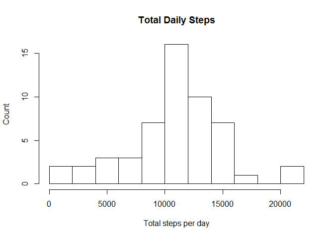
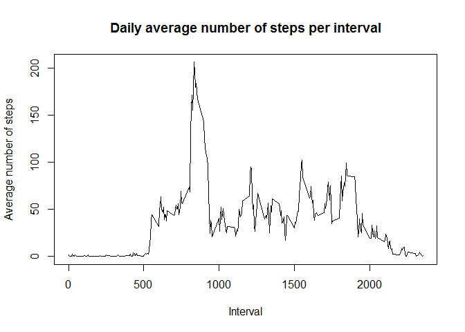
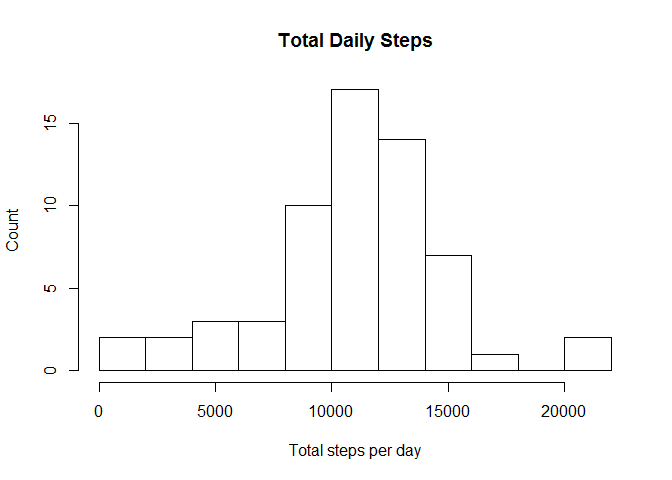
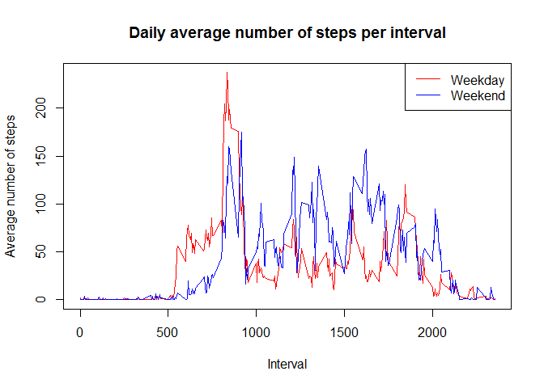

#### Write a report that answers the questions detailed below.  

Set the working directory and options

```r
setwd("C:/Documents and Settings/Al/My Documents/R/DataSci_Courses/ReproResearch/PeerAs_1")
echo=TRUE
```

Load required packages

```r
library(plyr)
library(knitr)
```

#### Loading and preprocessing the data
  Load the data     
  Check if the dataset can be found locally, in order to avoid multiple downloads;   
 Downloaded if needed


```r
file1 <- "ACTIVE.zip"
file2 <- "activity.csv"
if (!file.exists(file1)) {
  download.file("https://d396qusza40orc.cloudfront.net/repdata%2Fdata%2Factivity.zip", "ACTIVE.zip")
}
# check if unzipped file is found locally, unzip if required
if (!file.exists(file2)) {
  unzip("ACTIVE.zip")
}
activity <- read.csv("activity.csv",stringsAsFactors=FALSE)
```

Transform the data

```r
activity$date  <- as.Date(activity$date)     # Change "date" to Date format
activity$steps <- as.numeric(activity$steps) # Make "steps" numeric
activity$dayname <- weekdays(activity$date)  # Add day of week name to rows
act  <- na.omit(activity)                    # Remove rows with missing values
```
#### Mean total number of steps taken per day

   Histogram of the total number of steps taken each day   
  
   

```r
dayTotal <- ddply(act, "date", summarize, sumDay.steps = sum(steps)) # Calculate daily totals
hist(dayTotal$sumDay.steps,11, xlab="Total steps per day", ylab="Count", main="Total Daily Steps")
```

 

 Mean and median total number of steps taken per day

```r
mean(dayTotal$sumDay.steps)
```

```
## [1] 10766
```

```r
median(dayTotal$sumDay.steps)
```

```
## [1] 10765
```
The daily mean number of steps is 1.0766 &times; 10<sup>4</sup> and the median is 1.0765 &times; 10<sup>4</sup>.


#### Average daily activity pattern

    Time series plot of the number of steps taken per 5-minute interval averaged across all days.


```r
intMeans <- ddply(act, "interval", summarize, intMean = mean(steps))
plot(intMeans$interval,intMeans$intMean,type="l",
     main="Daily average number of steps per interval",
     xlab="Interval",
     ylab="Average number of steps")
```

 
   
  Which 5-minute interval, on average across all the days in the dataset, contains the maximum number of steps?


```r
sorted <- intMeans[order(intMeans$intMean,decreasing = TRUE),]
sorted[1,1]
```

```
## [1] 835
```
 The 835 5-minute interval averaged across all days contains the maximum number of steps in the data set.

#### Imputing missing values

  Calculate and report the total number of missing values in the dataset. 
  

```r
missing <- nrow(activity) -  nrow(act); missing
```

```
## [1] 2304
```
There are 2304 missing values in the data set.

####  Strategy for filling in all of the missing values in the dataset.

Create a new dataset that is equal to the original dataset but with the missing data filled in.

Infill strategy will be to use the mean number of steps in each interval for each day of week.

```r
intervalMeans <- ddply(act,c("dayname","interval"), summarise, mean.steps = round(mean(steps))) #Mean steps per interval
```
 Create data frame from original data containing only NAs 

```r
 allNAs <- subset(activity, is.na(steps) == TRUE, select = steps:dayname)
```
Merge allNAs with intervalMeans

```r
infilled <- merge(allNAs,intervalMeans,c("dayname","interval"))
infilled <-  infilled[,-3]        # Remove column with NAs
infilled <- infilled [c(4,3,2,1)] # Reorder columns
names(infilled) = c("steps", "date", "interval", "dayname") # Change column name "mean.steps" to "steps"
```
New dataset equal to the original dataset but with the missing data filled in

```r
actNew <- rbind(act, infilled) # Add infilled set
newdata <- actNew[order(actNew$date, actNew$interval),]  # Sort combined set based on time 
```
   Histogram of the total number of steps taken each day  
   

```r
smryNew <- ddply(newdata, "date", summarize, sum.steps = sum(steps)) # Calculate new value of steps per day
hist(smryNew$sum.steps,11, xlab="Total steps per day", ylab="Count", main="Total Daily Steps")   
```

 

####    Mean and median total number of steps taken per day. 

```r
mean(smryNew$sum.steps)
```

```
## [1] 10821
```

```r
median(smryNew$sum.steps)
```

```
## [1] 11015
```

Do these values differ from the estimates from the first part of the assignment? 
What is the impact of imputing missing data on the estimates of the total daily number of steps?

The daily mean number of steps is 1.0821 &times; 10<sup>4</sup> and the median is 1.1015 &times; 10<sup>4</sup>compared to the previous mean of 1.0766 &times; 10<sup>4</sup> and median of 1.0765 &times; 10<sup>4</sup>. The difference in total daily steps using infill data is 0.5%.

####   Are there differences in activity patterns between weekdays and weekends?

    New factor variable in the dataset with two levels - "weekday" and "weekend" indicating whether a given date is a weekday or weekend day.
    

```r
newdata$dayfactor=as.factor(ifelse(weekdays(newdata$date) %in% c("Saturday","Sunday"), "Weekend", "Weekday"))
```
   

 Time series plot of the 5-minute interval (x-axis) and the average number of steps taken, averaged across all weekday days or weekend days (y-axis). 
 

```r
intMeans1 <- ddply(newdata[which(newdata$dayfactor == "Weekday"),], "interval", summarize, intMean = mean(steps))
 intMeans2 <- ddply(newdata[which(newdata$dayfactor == "Weekend"),], "interval", summarize, intMean = mean(steps))
```

```r
plot(intMeans1$interval,intMeans1$intMean,type="l",col = "RED",
     main="Daily average number of steps per interval",
     xlab="Interval",
     ylab="Average number of steps")
 lines(intMeans2$interval,intMeans2$intMean,type="l",col = "BLUE")    
legend("topright", c("Weekday","Weekend"), lty=c(1,1), lwd=c(1,1), col=c("red","blue"))  
```

 

 

